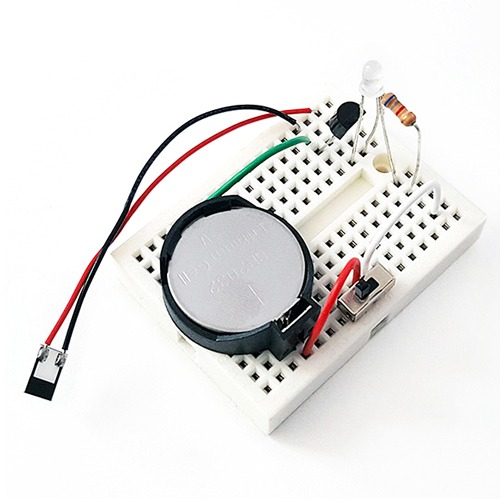
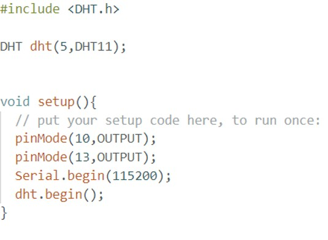
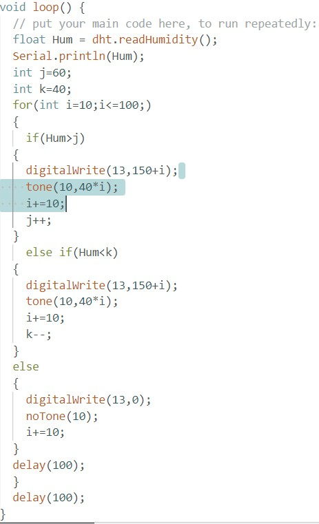

# 습도 감지기

(출처:https://ideascience.co.kr/product/%EC%8A%B5%EB%8F%84-%EA%B0%90%EC%A7%80%EA%B8%B05%EC%9D%B8-%EC%84%B8%ED%8A%B8/1501/)

***습도***: 대기 중에 포함된 수증기의 지표

적절한 실내 습도: **40~60**

**습도가 낮을 때:** 천식, 바이러스 위험 증가

**습도가 높을 때:** 호흡기 질환, 해충 번식 위험 증가

# 하드웨어

**하드웨어가 해체된 관계로 하드웨어 사진은 ***없습니다***.**

# 소프트 웨어

For문으로 i가 100이 될 때까지 반복

습도가 j를 넘어가면 
LED: 150+i의 세기
스피커: 0.01초 동안 40Xi의 세기

습도가 k보다 낮아지면 
LED: 150+i의 세기
스피커: 0.01초 동안 40Xi의 세기

**결론**: 습도가 60이나 40에 멀어질 수록 더 높고 소리가 세게 울림. 

